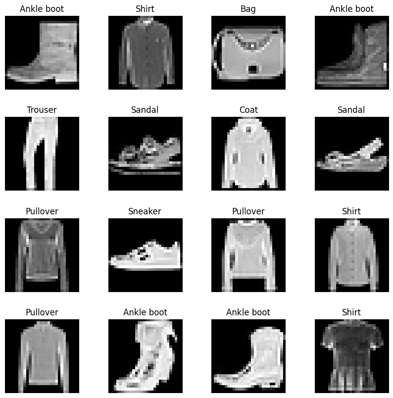
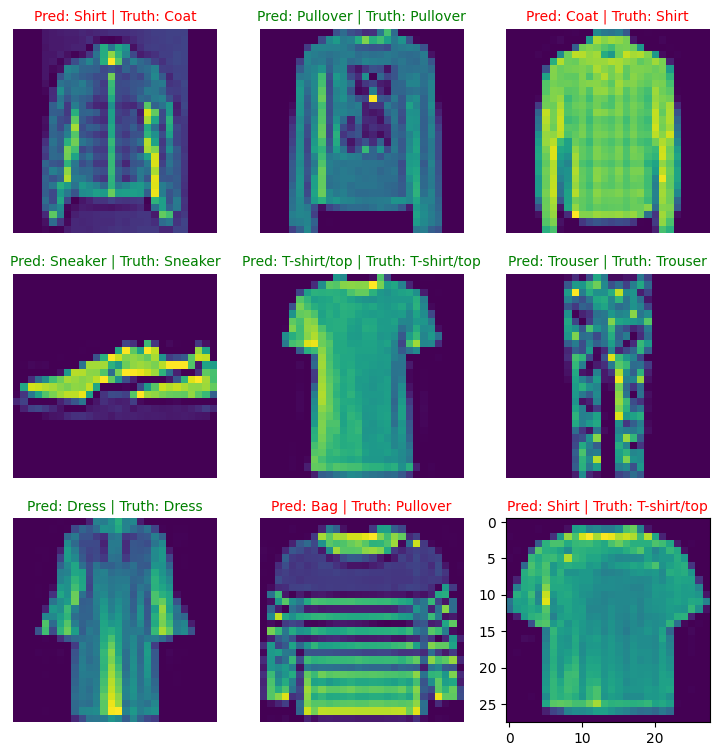
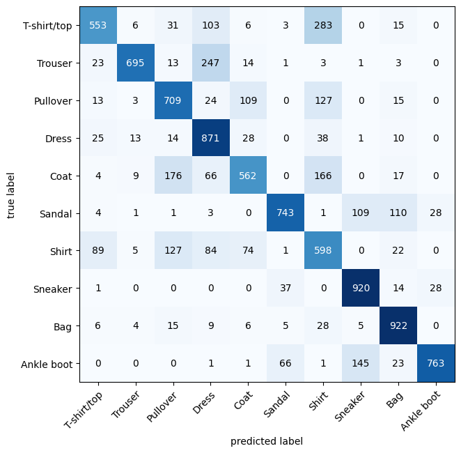

# PyTorch Computer Vision Fundamentals


##  About the Project
This repository documents my exploration into the domain of **Computer Vision** using PyTorch. The core objective of this project is to build a machine learning model capable of identifying and classifying images of clothing. 

Working with the **FashionMNIST** dataset, this project tracks the evolution from a baseline fully connected neural network to a powerful **Convolutional Neural Network (CNN)**. It heavily utilizes the `torchvision` ecosystem to load, transform, and process image data efficiently.


##  Key Concepts & Workflow

### 1. Data Preparation & Torchvision Ecosystem
Computer vision models require images to be converted into numerical representations. I utilized `torchvision.datasets` to download the FashionMNIST dataset and `torchvision.transforms.ToTensor()` to convert the raw image data into PyTorch tensors.

### 2. Mastering Tensor Dimensionality
Image data introduces a new level of complexity regarding shapes: `[color_channels, height, width]`. A key part of this workflow involved manipulating tensor shapes using `torch.permute()` and `torch.squeeze()` to ensure compatibility between PyTorch (which expects channels first) and Matplotlib (which expects channels last for plotting).


*Visualizing randomized batches of the FashionMNIST dataset.*

### 3. Batching with DataLoaders
Passing an entire dataset into a model at once is computationally expensive and often impossible. I implemented `torch.utils.data.DataLoader` to turn the large dataset into manageable Python iterables (mini-batches). This allows the model to update its gradients more frequently and train efficiently.

### 4. Convolutional Neural Networks (CNNs)
While standard linear layers look at a whole image indiscriminately, CNNs look at images in localized patches, making them vastly superior for discovering spatial patterns (like edges, shapes, and textures). 
* **`nn.Conv2d`:** Implemented convolutional layers with sweeping kernels to extract feature maps from the images.
* **`nn.MaxPool2d`:** Used pooling layers to compress the spatial dimensions of the image, retaining only the most important features while reducing computational overhead.

### 5. Training, Inference & Error Analysis
After building the architecture and running the training loops, I evaluated the model on unseen test data. Beyond just looking at accuracy, I visualized the predictions alongside the ground truth labels to conduct error analysis—observing, for example, if the model confuses visually similar classes like "Shirt" and "T-shirt/top".



*Visualizing the CNN's predictions against actual test dataset labels.*

Making a confusion Matrix for further performance evaluation.


*Darker Boxes along the diagonal is a good sign # Ideal Confusion matrix has only the diagonal line as darkened.*

##  Tech Stack
* **Language:** Python
* **Deep Learning Framework:** PyTorch (`torch`, `torch.nn`, `torch.utils.data`)
* **Computer Vision Library:** Torchvision (`datasets`, `transforms`, `models`)
* **Data Visualization:** Matplotlib

##  Getting Started (Installation)

To clone and run this project locally:

 **Clone the repository:**
   ```bash
   git clone [https://github.com/YOUR_USERNAME/YOUR_REPO_NAME.git](https://github.com/AbdiR0099/pytorch_computer_vision.git)
   cd pytorch_computer_vision
